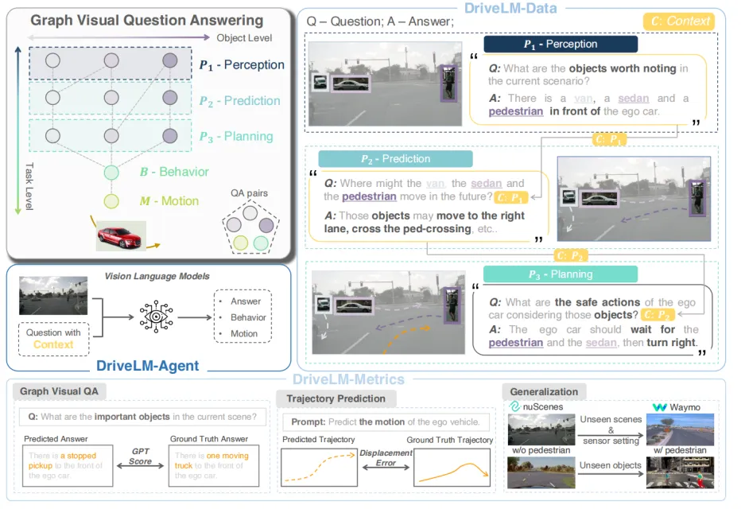
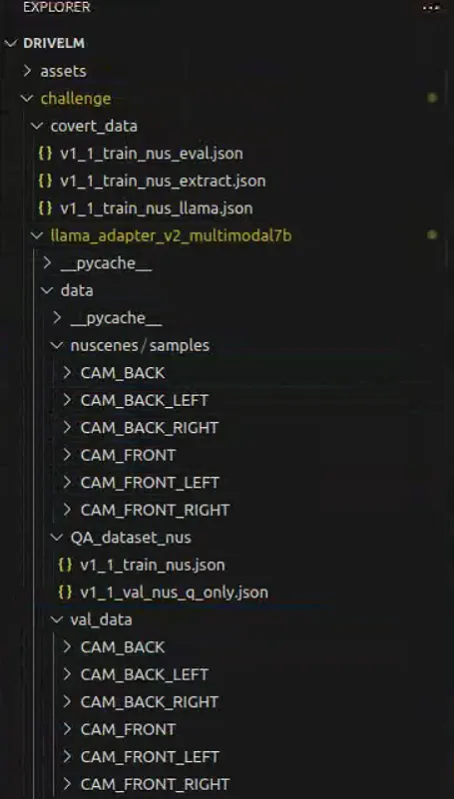
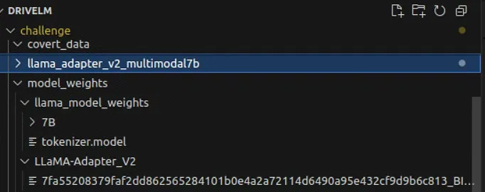
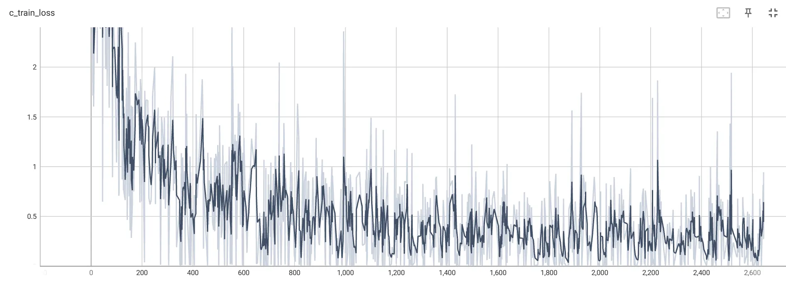
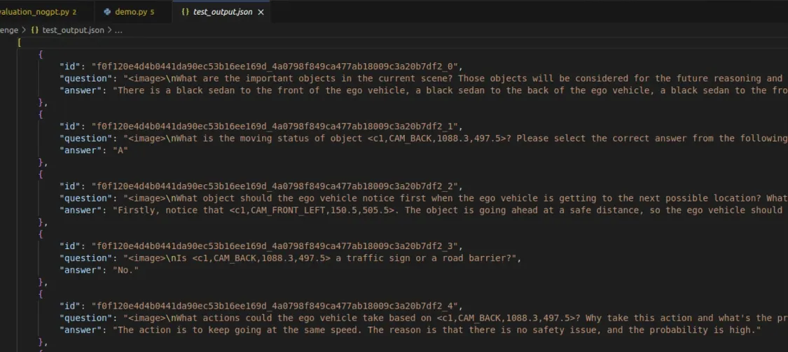

# Finetune-e2e-model-DriveLM
Finetune DriveLM to improve generalization ability and enable interaction with human.

<div align="center">

</div>

## Getting started

### 1. Installation


#### Clone Project 

```bash
git clone --recursive https://github.com/OpenDriveLab/DriveLM.git
```
#### Install

```bash
conda create -n drivelm python=3.8
conda activate drivelm
cd ./DriveLM/challenge/llama_adapter_v2_multimodal7b
pip install -i https://mirrors.tuna.tsinghua.edu.cn/pypi/web/simple/ -r requirements.txt
```

### 2. Preparing Data

Download subset of datasets from Huggingface and perform data processing.

```bash
https://huggingface.co/datasets/OpenDriveLab/DriveLM

cd ./DriveLM/challenge/
python extract_data.py
python convert_data.py
python convert2llama.py

```

<div align="left">

</div>

### 3. Download pretrained models

```bash
llama:
https://huggingface.co/nyanko7/LLaMA-7B/tree/main

LLaMA-Adapter V2:
https://github.com/OpenGVLab/LLaMA-Adapter/releases/tag/v.2.0.0
```

<div align="left">

</div>


## Fine-tuning DriveLM


### 1. Fine-tuning

```bash
cd ./DriveLM/challenge/llama_adapter_v2_multimodal7b
python main_finetune.py --data_config "/APP/DriveLM/challenge/llama_adapter_v2_multimodal7b/finetune_data_config.yaml" --batch_size 1 --epochs 3 --warmup_epochs 1 --blr 10e-4 --weight_decay 0.02 --llama_path "/APP/DriveLM/challenge/model_weights/llama_model_weights" --output_dir "/APP/DriveLM/outputs" --pretrained_path "/APP/DriveLM/challenge/model_weights/LLaMA-Adapter_V2/7fa55208379faf2dd862565284101b0e4a2a72114d6490a95e432cf9d9b6c813_BIAS-7B.pth" --log_dir "/APP/DriveLM/outputs/output.log"
```

<div align="center">

</div>

### 2. Inference


```bash
cd ./DriveLM/challenge/llama_adapter_v2_multimodal7b
python demo.py
```
<div align="center">

</div>

### 3. Visualization

```bash
cd ./DriveLM/challenge/llama_adapter_v2_multimodal7b
task_vis.ipynb
```


## License and Citation

All assets and code in this repository are under the Apache 2.0 license unless specified otherwise. The language data is under CC BY-NC-SA 4.0. Other datasets (including nuScenes) inherit their own distribution licenses.

```bibtex
@article{sima2023drivelm,
  title={DriveLM: Driving with Graph Visual Question Answering},
  author={Sima, Chonghao and Renz, Katrin and Chitta, Kashyap and Chen, Li and Zhang, Hanxue and Xie, Chengen and Luo, Ping and Geiger, Andreas and Li, Hongyang},
  journal={arXiv preprint arXiv:2312.14150},
  year={2023}
}
```
```bibtex
@misc{contributors2023drivelmrepo,
  title={DriveLM: Driving with Graph Visual Question Answering},
  author={DriveLM contributors},
  howpublished={\url{https://github.com/OpenDriveLab/DriveLM}},
  year={2023}
}
```
